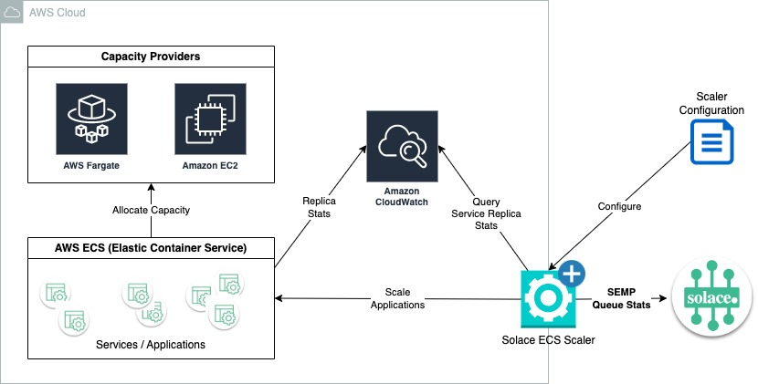

# ECS Scaler Demo Setup



The Solace ECS Scaler is a Java application built by Solace that allows you to scale apps running on AWS ECS based on Solace Queue Metrics.The Solace ECS Scaler is built speficially for use with Guaranteed consumer applications. The appplication monitors queue metrics (rates and depths), and scales consumers based on configured thresholds.

This mash-up of the Partitioned Queues demo + Solace ECS Scaler borrows significantly from my colleague Dennis' project here, where he went into great detail to explain the Solace PubSub+ scaler: [https://github.com/dennis-brinley/partitioned-queue-demo](https://github.com/dennis-brinley/partitioned-queue-demo).  Please check it out for more detailed information.


## Step 1 - get Terraform
```
cd terraform
terraform init
```


## Step 2 - Build & Deploy Docker container of PQSubscriber


From the "main" / "root" directory of this project:

```
./gradlew clean assemble
docker build -t solace-pqdemo-subscriber:latest --file DockerfileECSDemo .
```

You should now have a Docker image available to be used by the demo:

```
$ docker images | grep solace-pqdemo-subscriber

REPOSITORY                            TAG              IMAGE ID       CREATED          SIZE
solace-pqdemo-subscriber              latest           c37025f6db50   38 minutes ago   665MB
```

Tag the image so we can deploy to a public Docker repo
```
docker image tag solace-pq-demo-subscriber:latest <username>/solace-pq-demo-subscriber:1.0
```

Push the image to docker hub
```
docker image push <username>/solace-pq-demo-subscriber:1.0
```

## Step 3 - Configure subscriber and broker connection info for ECS Deployment and SEMP Credentials for Solace Terraform
Additional Instructions
* If using a cloud event broker, you must submit a request to support@solace.com requesting that they update the SEMP CORS rule to allow all origins
* If using a deployed software broker, you must allow the PQSubsriber access via security groups
* If using a local software broker, you must enable the PQSubscriber to access
```
cd terraform
cp terraform.tfvars.example terraform.tfvars
```
* Replace the entries with the appropriate values for your deployment


## Step 4 - Deploy Terraform
Prerequisites:
* Connection to AWS with sufficient permissions to create VPC, ECS, and Secrets resources (See main.tf for full list of required resources)
```
terraform apply
```
* Verify successful deployment of resources to AWS
* Verify successful deployment and configuration of queue on the solace broker

## Step 6 - Get the Solace ECS Scaler
1. Download the Solace ECS Scaler Project from https://github.com/SolaceLabs/solace-ecs-scaler
2. Run the Solace ECS Scaler by following the instructions included in the project
* Sample Config - Replace placeholders with actual values. Update maxReplicaCountTarget to match the number of partitions on your queue
```
---
brokerConfig:
  activeMsgVpnSempConfig:
    brokerSempUrl: <broker_semp_url>
    username: <semp_admin_username>
    password: <semp_admin_password
  msgVpnName: <vpn_name>
  pollingInterval: 10
ecsServiceConfig:
  - ecsCluster: pq-demo-cluster
    ecsService: pq-subscriber-service
    queueName: <queue_name>
    scalerBehaviorConfig:
      minReplicaCount: 1
      maxReplicaCount: 100
      messageCountTarget: 10
      messageReceiveRateTarget: 10
      messageSpoolUsageTarget: 100
      scaleOutConfig:
        maxScaleStep: 5
        cooldownPeriod: 60
        stabilizationWindow: 10
      scaleInConfig:
        maxScaleStep: 5
        cooldownPeriod: 60
        stabilizationWindow: 60

```

## Step 7 - run the demo

Refer to the README in the parent directory, but essentially:
 - start the Stateful Control app so that each new consumer instance added by the Solace ECS Autoscaler will have the same config
 - start the Order Checker if you want to verify sequencing per-key
 - configure the SLOW subscriber delay to correspond with the `messageReceiveRateTarget` threshold chosen in the Solace scaler (with some wiggle room)
    - e.g. set the target rate to 90 msg/s, but adjust the SLOW subscriber delay to 10 ms to allow for approximately 100 msg/s
 - start the Publisher, increase the rates, watch the scaler do its thing!

## Help


## Tear Down
TODO: steps to teardown terraform deployment
``````
cd ecs-demo/terraform
terraform destroy
``````


